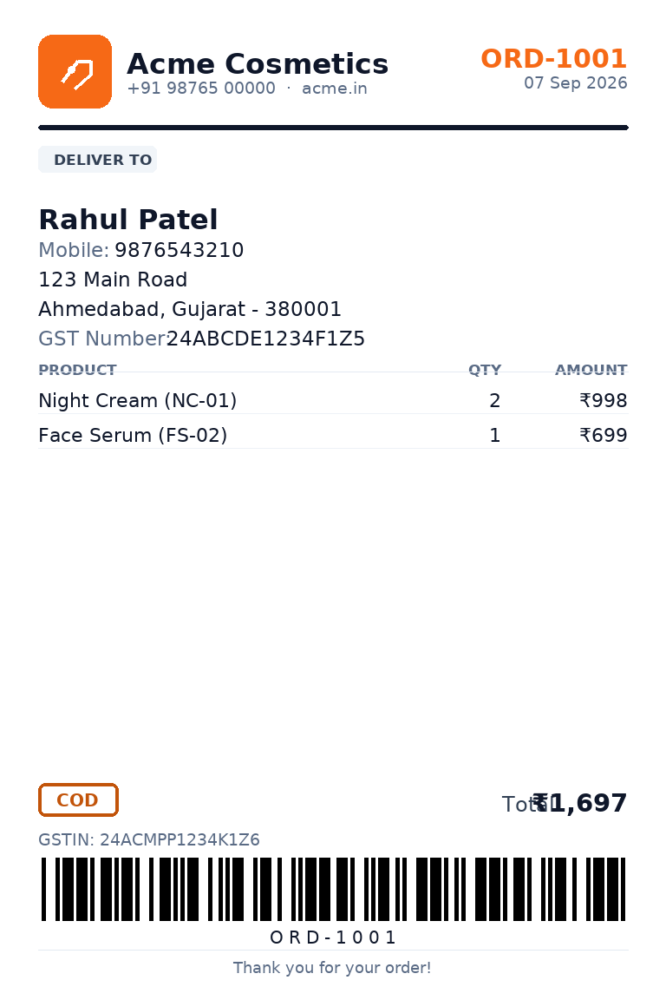

# Order Label Manager

A fast, lightweight Chrome extension (Manifest V3) for businesses that take orders on WhatsApp:

**WhatsApp order → New Order → Save (Google Sheets row) → Generate Label → Print / Download PDF**

- No frameworks, no state libraries — plain TypeScript + Vite (~65 KB of JS total).
- Your fields are the spreadsheet columns. Every order is exactly one row.
- Professional 4″×6″ (or A6) shipping labels with Code 39 barcode, browser printing and **per-order PDF download**.

---

## Install (Chrome)

**Option A — use the ready-made zip**

1. Download / extract `order-label-manager.zip` (production build).
2. Open `chrome://extensions`, enable **Developer mode** (top right).
3. Click **Load unpacked** and select the extracted folder (the one containing `manifest.json`).

**Option B — build from source**

```bash
npm install
npm run build        # type-checks, builds dist/ and order-label-manager.zip
```

Then load `dist/` via **Load unpacked**.

> The extension ships with sample data (Night Cream / Face Serum / Day Cream, 6 typical customer fields) so you can try everything immediately — products, fields and orders can all be edited or deleted.

## First run

1. Pin the extension and click the icon — the app opens (it opens with a full sidebar when opened in a tab).
2. **Custom Fields** — create your fields once (Customer Name, Phone, Address, City, Pincode, GST Number, …). Each field becomes a spreadsheet column.
3. **Settings → Business** — name, logo, phone, address, GST, footer.
4. **Settings → Google Sheets** — paste your spreadsheet link, add your OAuth Client ID (one-time, 2 minutes — steps are shown right in Settings), click **Connect Spreadsheet**. Existing matching columns are reused; only missing columns are created. You can map any field to a different existing column.
5. **New Order** — fill the fields, pick products + quantities, choose payment status, **Save Order**.

## Label preview (sample data)



## Google Sheets: the one rule

| Order Number | Customer Name | Phone      | Address    | City      | … | Night Cream Qty | Face Serum Qty |
| ------------ | ------------- | ---------- | ---------- | --------- | - | --------------: | -------------: |
| ORD-1001     | Rahul         | 9876543210 | Main Road  | Ahmedabad | … |               2 |              1 |
| ORD-1002     | Priya         | 9988776655 | Station Rd | Surat     … |               1 |              0 |

- Fields = **columns** (created once), orders = **rows** (one per order).
- Editing an order updates **the same row** (matched by order number).
- Nothing is ever deleted; no duplicate columns; no columns per customer.
- Standard columns `Order Number, Order Date, Payment Status, Amount` plus one `«Product» Qty` column per product are created alongside your fields.

## Labels

- **Label preview** with `Back` / `Print Label` / `Download Label`.
- **Print Label** opens a clean print layout (`@media print` hides all UI), 4″×6″ by default, A6 supported — change it in Settings → Label.
- **Download Label** saves that order's label as `ORD-1001-label.pdf` — no printing required.
- The label automatically uses your custom fields; choose exactly which fields and sections appear on it in **Settings → Label**.
- Optional Code 39 barcode of the order number is included by default.
- **Text Size** (Small → Extra Large) scales every label font in preview, print and PDF alike.

## Other pages

- **Dashboard** — today's orders, pending labels, paid/COD counts + shortcuts.
- **Orders** — search by order number / customer / phone; per-order `Label` `Edit` `Print` `Download`; **Excel · Today** and **Excel · All** buttons export orders to a real `.xlsx` file (same column layout as your spreadsheet, numeric Amount/Qty cells). A full-width orders page opens via the ↗ button (handy in a browser tab).
- **Products** — name, SKU, price, active toggle.
- **Settings → Backup** — export everything as JSON, import a previous export.

Duplicate order numbers are blocked with an `Order already exists.` dialog offering **Open Order** / **Edit Order** (checked locally and in the spreadsheet). Order numbers auto-increment with a configurable prefix/starting number, and manual numbers are always allowed.

## Permissions & security

- `storage` — your data stays in `chrome.storage.local` (fields, products, settings, orders, counters).
- `identity` — Google sign-in via `chrome.identity.launchWebAuthFlow`. Access tokens live in memory only and are never stored or logged.
- Host permissions limited to `sheets.googleapis.com` and `oauth2.googleapis.com`.
- No secrets are hard-coded: you supply **your own** OAuth Client ID (Client IDs are not secret). Full `spreadsheet` scope is requested because `values:append`/`update` require write access.

## Development

```bash
npm run dev        # vite dev server (UI only; chrome.* APIs are no-ops outside the extension)
npm run build      # type-check + production build to dist/ + order-label-manager.zip
npm test           # 136 automated checks (unit + a DOM test that drives the real built bundle)
npm run typecheck
```

Structure (kept deliberately small):

```
public/            manifest.json, icons, Inter font
src/
  background/      minimal MV3 service worker
  pages/           dashboard, order form, orders, products, fields, settings, label preview
  services/        storage, store, google (OAuth+Sheets), sheets-data (mapping), label, barcode
  types/           shared types
  utils/           helpers
tests/             unit + end-to-end style DOM tests (tsx + happy-dom)
```

Performance notes: order entry is fully local (instant open), only two Sheets requests are ever made per save (header check is cached locally; append/update the single row), no large libraries, barcode is generated inline.
